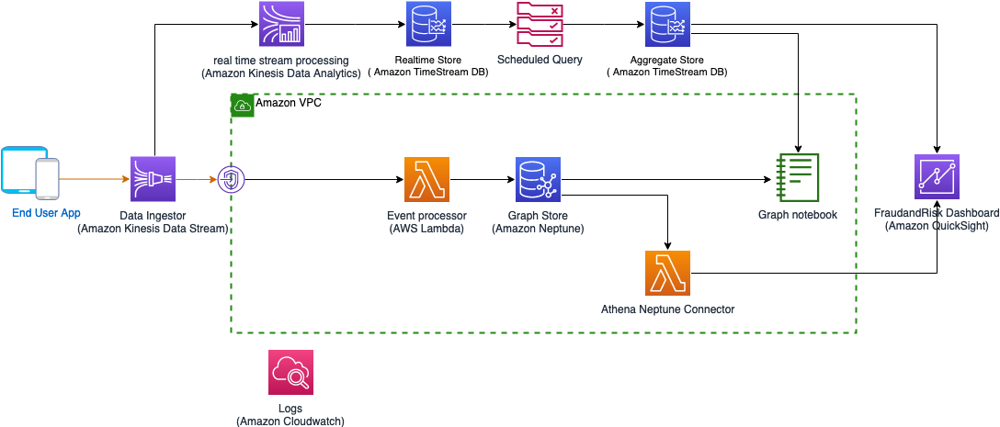
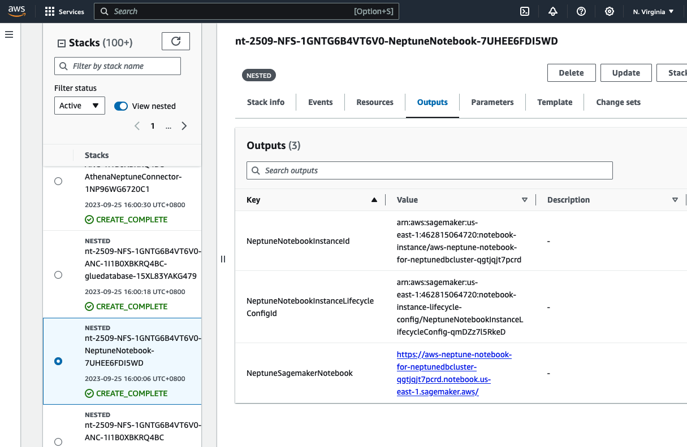
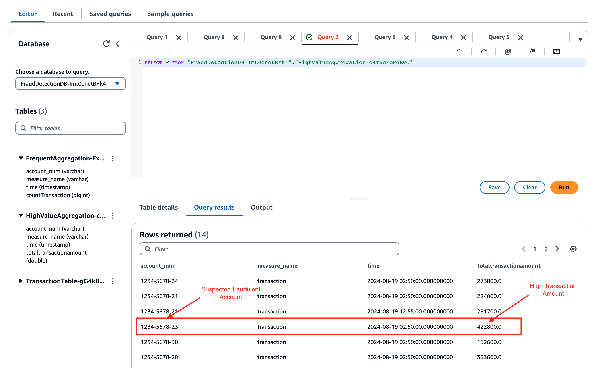
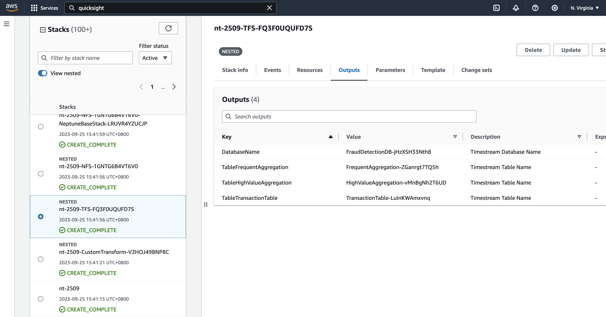
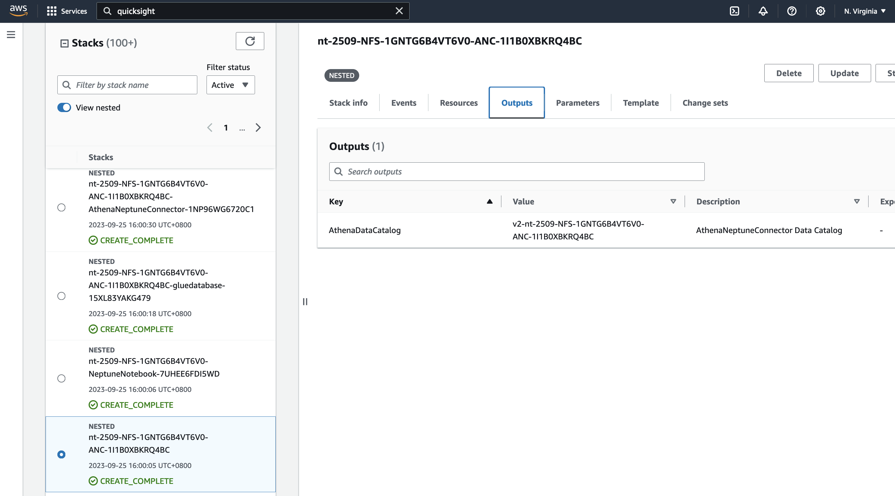

# Guidance for Transactional Fraud Detection on AWS

## Table of Contents

List the top-level sections of the README template, along with a hyperlink to the specific section.

### Required

1. [Overview](#overview-required)
    - [Cost](#cost)
2. [Prerequisites](#prerequisites-required)
    - [Operating System](#operating-system-required)
3. [Deployment Steps](#deployment-steps-required)
4. [Deployment Validation](#deployment-validation-required)
5. [Running the Guidance](#running-the-guidance-required)
6. [Next Steps](#next-steps-required)
7. [Cleanup](#cleanup-required)
8. [Authors](#authors-optional)

## Overview

This solution will demonstrate the use of Timestream to monitor micro-level fraud patterns (e.g., spikes in transaction traffic or rapidly changing accounts associated with a single IP address) and use that to flag potential fraudulent activity within a larger macro-level fraud graph stored in Neptune. Neptune's strength is seeing fraud within the macro environment, but not in specific windows of time. Therefore these services should complement each other in a measurable way (not yet proven). This guidance will show how to use these technologies together for fraud detection, but the same pattern can be applied to other use cases where time sensitive micro-indicators and context sensitive macro-level indicators can both be used, such as Customer Data Platforms, trading risk platforms, etc. 

### Reference architecture



### Cost

_You are responsible for the cost of the AWS services used while running this Guidance. As of August 2024, the cost for running this Guidance with the default settings in the <Default AWS Region US East (N. Virginia) > is approximately $800.00._

_We recommend creating a [Budget](https://docs.aws.amazon.com/cost-management/latest/userguide/budgets-managing-costs.html) through [AWS Cost Explorer](https://aws.amazon.com/aws-cost-management/aws-cost-explorer/) to help manage costs. Prices are subject to change. For full details, refer to the pricing webpage for each AWS service used in this Guidance._

### Typical cost. Note services are metered based on usage

The following table provides a sample cost breakdown for deploying this Guidance with the default parameters in the US East (N. Virginia) Region for one month.

| AWS service                   | Dimensions                                                     | Cost [USD]/month |
|-------------------------------|----------------------------------------------------------------|----------------|
| Amazon Timestream             | Number of records (1000 per hour), store retention (12 months) | $ 193.75       |
| Amazon Neptune                | 1 Neptune instance type (db.r6g.large)                         | $ 574.80       |
| Amazon Kinesis Data Streams   | 1,000 active users per month without advanced security feature | $ 146.12       |
| AWS Lambda                    | Number of requests (1000 per hour)                             | $ 54.17        |

## Prerequisites

### Operating System

The deployed solution is serverless. Deployed resources itself do not have particular Operating System (OS) requirements. However to build the solution,
deploying the solution and running a transaction simulation the provided shell scripts and python programs need a local environment with the following requirementsL: 

| Step                         | Environment  | Requirements                                    |
|------------------------------|--------------|-------------------------------------------------|
 | Compile and deploy resources | Shell Script | Linux or Mac <br/> - Python 3.9 <br/> - Java 11 |
| Simulate transaction stream  | Python       | - Python 3.9                                    |

### AWS account requirements

This deployment requires to have a VPC with 3 subnets available and the following resources:

- S3 bucket for uploading deployment artifacts and output reports
- VPC
- 3 Subnets
- Optional: If using **Amazon Athena** (not required), VPC needs connection to **Amazon Glue** Endpoint as described in [Configuring interface VPC endpoints (AWS PrivateLink) for AWS Glue (AWS PrivateLink)](https://docs.aws.amazon.com/glue/latest/dg/vpc-interface-endpoints.html)


### Supported Regions

The solution can be deployed in the following regions:
- AWS GovCloud (US-West)
- Asia Pacific (Tokyo)
- Asia Pacific (Sydney)	
- Europe (Frankfurt)
- Europe (Ireland)
- US East (N. Virginia)
- US East (Ohio)
- US West (Oregon)	

## Deployment Steps

1. Clone the repo using command
```
git clone git@github.com:aws-solutions-library-samples/guidance-for-transactional-fraud-detection-on-aws.git
```
2. cd to the repo folder <br/>
```
cd aws-solutions-library-samples/guidance-for-transactional-fraud-detection-on-aws
```
3. create S3 bucket to be used for solution
```
export S3BucketName="riskandfraud-$RANDOM"
aws s3api create-bucket --bucket $S3BucketName --region us-east-1
```
4. Package solution
```
./deployment/setup.sh $S3BucketName
```
5. Deploy solution using CloudFormation, replace values for region, vpc, subnets and S3 as per your environment
```
export region=<AWSRegion>
export stack_name="nt-full-$(date +"%d-%s-%h")"
export vpc=<VPCId>
export subnet1=<SubnetID1>
export subnet2=<SubnetID2>
export subnet3=<SubnetID3>
aws cloudformation create-stack --stack-name $stack_name --template-url \
    https://s3.amazonaws.com/$S3BucketName/templates/base.yaml  \
    --parameters ParameterKey="VPCId","ParameterValue"=$vpc ParameterKey="SubnetId1",ParameterValue=$subnet1  ParameterKey="SubnetId2",ParameterValue=$subnet2 ParameterKey=SubnetId3,ParameterValue=$subnet3 ParameterKey=S3Bucket,ParameterValue=$S3BucketName \
    --capabilities CAPABILITY_AUTO_EXPAND CAPABILITY_NAMED_IAM CAPABILITY_IAM \
    --region $region \
    --profile default
```
## Deployment Validation

Make note of the stack id, it takes arround 35 min for the template to run complete. You can monitor the stack progress in Cloudformation console.

Sample output:

```
{
    "StackId": "arn:aws:cloudformation:us-east-1:461115064720:stack/nt-full-25-1695636313-Sep/06a59240-5b8b-11ee-b3ed-0ec66bc9c473"
}
```
## Running the Guidance (required)

1. Run producer
Once the CloudFormation template is deployed, you can putting some test data to verify the solution. Change the Kinesis stream name as per the CloudFormation output

Run following command 

```
pip3 install schedule boto3 aws_requests_auth requests uuid watchtower urllib3==1.26

python ./source/kinesisproducer/kinesisproducer.py -r us-east-1 -k nt-attempt2403-EventStream
```

2. Verify the solution [Adhoc analysis]

Refer the notebook created 



Upload the [ipython notebook](./source/notebooks/NT-FraudAndRisk.ipynb)  to Neptune Notebook created. Execute the cells to analyse the data.


The execution above assumed tha fraudulent transaction was with account "123-5678-22". In the following steps we will show how Amazon Timestream can be used to identify the fraudulant accounts:

3. Verify data ingested in Timestream

After ingesting the transactions in step 1. Use the Timestream Query Editor to query the latest data

```SQL
SELECT * FROM "FraudDetectionDB-<your db ID>"."TransactionTable-<your table id>" WHERE time between ago(15m) and now() ORDER BY time DESC LIMIT 10 
```

This query can be generated by using the preview data feature:


4. Scheduled Queries executions

Every 5 minutes a scheduled Timestream query is executed to identify high value transactions or frequent transactions as potential fraudulent activity:


The results can be queried after waiting at least 5 minutes by querying the associated tables. Please note, to see all activities, the time filter in WHERE clause is removed here:




5. Optional: Verify the solution [Quicksight dashboard]

Once the CloudFormation template is deployed, setup the quicksight dashboard. Follow steps below:

* Setup QuickSight datasource for Timestream table "TableHighValueAggregation". Refer documentation: https://docs.aws.amazon.com/quicksight/latest/user/using-data-from-timestream.html Refer snapshot below:

* Setup Athena-Neptune datasource for Athena Datasource created using template. Refer documentation: https://aws.amazon.com/blogs/database/build-interactive-graph-data-analytics-and-visualizations-using-amazon-neptune-amazon-athena-federated-query-and-amazon-quicksight Refer snapshot below:


Refer the blog https://aws.amazon.com/blogs/database/build-interactive-graph-data-analytics-and-visualizations-using-amazon-neptune-amazon-athena-federated-query-and-amazon-quicksight/  on how to setup a QuickSight Analysis Dashboard. 


## Next Steps

- Integrate transaction stream into your existing transaction stream
- Evaluate criteria for additional fraud use cases

## Cleanup

- The solution can clean up by deleting the CloudFormation stack in the AWS console.

## Authors

- Norbert Funke - AWS Senior Timestream Solutions Architect