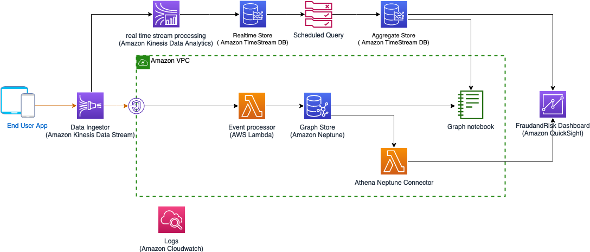
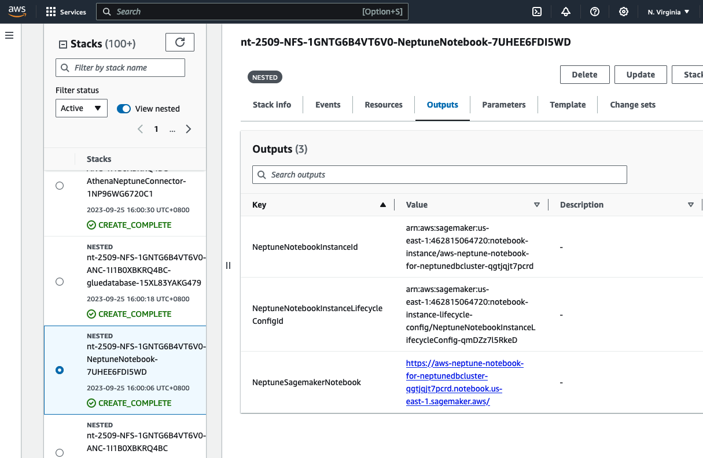
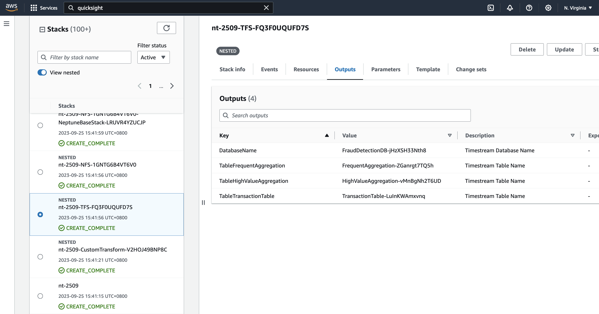
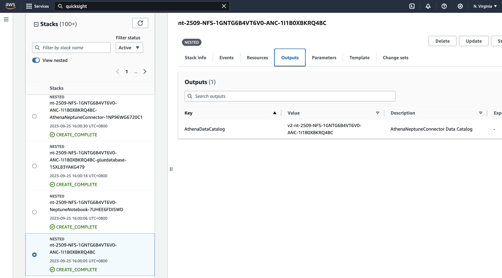

# Guidance for Transactional Fraud Detection on AWS
This solution will demonstrate the use of Timestream to monitor micro-level fraud patterns (e.g., spikes in transaction traffic or rapidly changing accounts associated with a single IP address) and use that to flag potential fraudulent activity within a larger macro-level fraud graph stored in Neptune. Neptune's strength is seeing fraud within the macro environment, but not in specific windows of time. Therefore these services should complement each other in a measurable way (not yet proven). This guidance will show how to use these technologies together for fraud detection, but the same pattern can be applied to other use cases where time sensitive micro-indicators and context sensitive macro-level indicators can both be used, such as Customer Data Platforms, trading risk platforms, etc. 

### Reference architecture



## Pre-Requisites
* Python 3.9

## Limitations
* TBD


### 1. Create S3 bucket

```
export S3BucketName="riskandfraud-$RANDOM"
aws s3api create-bucket --bucket $S3BucketName --region us-east-1

```

Make note of the S3 bucket created 

## 2. Package solution
Run following command to package and upload artefacts to S3 bucket created in Step 1
```
./deployment/setup.sh $S3BucketName
```

## 3. Deploy solution using CloudFormation
To deploy the solution, use existing Amazon VPC. If you don't have a VPC, refer [AWS Documentation]https://docs.aws.amazon.com/directoryservice/latest/admin-guide/gsg_create_vpc.html  for how to create one. The VPC should have 3 private subnet and one public subnet. The private subnet should have an AWS Nat Gateway attached. Use private subnets for the deploying the template.

Run following command

```
export region=<AWSRegion>
export stack_name="nt-full-$(date +"%d-%s-%h")"
export vpc=<VPCId>
export subnet1=<SubnetID1>
export subnet2=<SubnetID2>
export subnet3=<SubnetID3>
aws cloudformation create-stack --stack-name $stack_name --template-url \
    https://s3.amazonaws.com/$S3BucketName/templates/base.yaml  \
    --parameters ParameterKey="VPCId","ParameterValue"=$vpc ParameterKey="SubnetId1",ParameterValue=$subnet1  ParameterKey="SubnetId2",ParameterValue=$subnet2 ParameterKey=SubnetId3,ParameterValue=$subnet3 ParameterKey=S3Bucket,ParameterValue=$S3BucketName \
    --capabilities CAPABILITY_AUTO_EXPAND CAPABILITY_NAMED_IAM CAPABILITY_IAM \
    --region $region \
    --profile default
```

Make note of the stack id, it takes arround 35 min for the template to run complete. You can monitoring the stack progress in Cloudformation console.

Sample output:

```
{
    "StackId": "arn:aws:cloudformation:us-east-1:461115064720:stack/nt-full-25-1695636313-Sep/06a59240-5b8b-11ee-b3ed-0ec66bc9c473"
}
```

## 4. Run producer
Once the CloudFormation template is deployed, you can putting some test data to verify the solution. Change the Kinesis stream name as per the CloudFormation output

Run following command 

```
pip3 install schedule boto3 aws_requests_auth requests uuid watchtower urllib3==1.26

python ./source/kinesisproducer/kinesisproducer.py -r us-east-1 -k nt-attempt2403-EventStream
```

## 5. Verify the solution [Adhoc analysis]

Refer the notebook created 



Upload the [ipython notebook](./source/notebooks/NT-FraudAndRisk.ipynb)  to Neptune Notebook created. Execute the cells to analyse the data.

## 6. Verify the solution [Quicksight dashboard]

Once the CloudFormation template is deployed, setup the quicksight dashboard. Follow steps below:

* Setup QuickSight datasource for Timestream table "TableHighValueAggregation". Refer documentation: https://docs.aws.amazon.com/quicksight/latest/user/using-data-from-timestream.html Refer snapshot below:

* Setup Athena-Neptune datasource for Athena Datasource created using template. Refer documentation: https://aws.amazon.com/blogs/database/build-interactive-graph-data-analytics-and-visualizations-using-amazon-neptune-amazon-athena-federated-query-and-amazon-quicksight Refer snapshot below:


Refer the blog https://aws.amazon.com/blogs/database/build-interactive-graph-data-analytics-and-visualizations-using-amazon-neptune-amazon-athena-federated-query-and-amazon-quicksight/  on how to setup a QuickSight Analysis Dashboard. 


